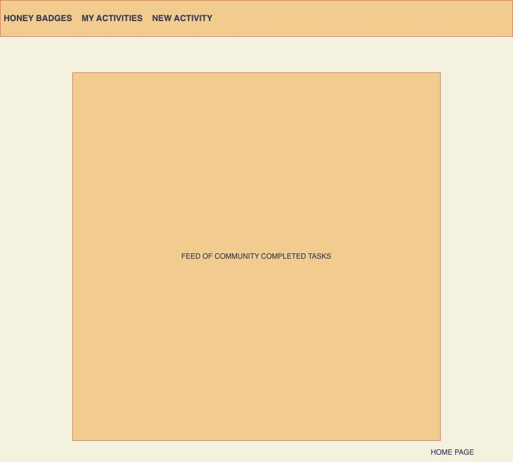
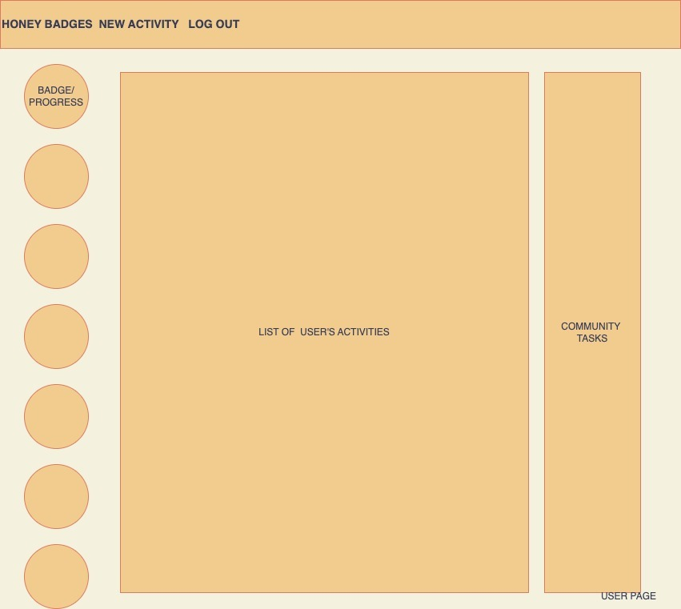
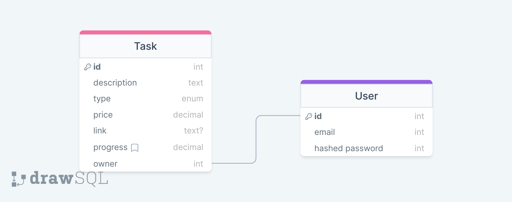

# Honey Badges

## Introduction
Honey Badges is an application where users can keep a running list of activites to complete and earn "badges" for completing multiple activites of the same type. Together, users form a community of badge-earners who can opt to share their accomplishments and use eachother's activities for inspiration. We hope the social aspect of creating and sharing activities will motivate users in a positive way. At the same time, users will have the option to make specific activities on their tasklist private. Users who need some help getting started can also choose to randomly generate an activity within specified parameters.

## Assignment of roles
Lauren Routier => Backend Developer
Michael Baun => Git Manager and DB Admin
Abdiresac Sheikdon => Full Stack Developer
Justin Hewinson => Frontend Developer

## User Stories
As a user, I want the ability to...
  - sign up.
  - sign in.
  - change my password.
  - sign out.
  - create my own activities.
  - update my progress on activities.

  - view current activities.
  - view my progress on my activities.
  - view other users progress on their (public) activities.
  - mark my activities as private.
  - complete activities.
  - view completed activities.
  - add images/links to videos of completed tasks/ tasks being completed.
  - set "complete by" goals for my activities.
  - earn badges by completing tasks.
  - earn rankings by earning badges.
  - view my earned badges.
  - view others earned badges.
  - view others rankings.

  - view all of my activities in a list. 
  <!-- - view my acomplishments. -->
  - add notes to my activities.
  - add notes to others current actitivities.
  - add notes to others completed activities.
  - read more details about activities. 
  - delete my activities. 
  <!-- - share my activities with other users. -->
  - request help on activities from other users.
  - view (public) activities others have created. 
  - add (public) activities that other people have created to my  activities. 
  - read all of the activities I have favorited. 
  - remove activities from my favorites. 

  - view all of my activities in a list.
  <!-- - view my accomplishments. -->
  - add notes to my activities.
  - add notes to others current activities.
  - add notes to others completed activities.
  - read more details about activities.
  - delete my activities.
  <!-- - share my activities with other users. -->
  - request help on activities from other users.
  - view (public) activities others have created.
  - add (public) activities that other people have created to my  activities.
  - read all of the activities I have favorited.
  - remove activities from my favorites.

  - search activities by name.
  - search activities by type.
  - search activities by amount of required participants.
  - search activities by price.
  - search activities by accessibility.

## General Approach
The application will consist of a backend API using Express and a client-side interface built mostly with React components. We will use MongoDB for to store data and our server will use mongoose to interact with the database. Our "activity" schema follows a pattern for defining activities from the Bored API for purposes of consistency. The decision here is practical and should contribute to user experience: we want to make activities easily searchable/filterable and hope that the user community can develop a common vocabulary for sharing/talking about their activities and accomplishments. 

## Technologies Used
- Backend API
    - Node/Express
    - Mongoose
    - axios 
    - [Bored API](https://www.boredapi.com/documentation)

 - Data Management
    - MongoDB

- Client Application
    - React
    - axios (primarily for calls to our own backend API)

## Wireframes

#### Sign-in/Signup

#### Landing Page

#### User's "Own" View

#### Activity Page

## Entity Relationships
The two main objects the app tracks are users and activities. Users create activities within pre-specified categories and can track their progress. 

#### Activities
Activities will be defined using the schema outlined in the ERD. In addition, we will implement virtuals which process completeness levels and activity types. These methods wiil assist the front-end client in displaying a UI which allows users to quickly see their progress. 

